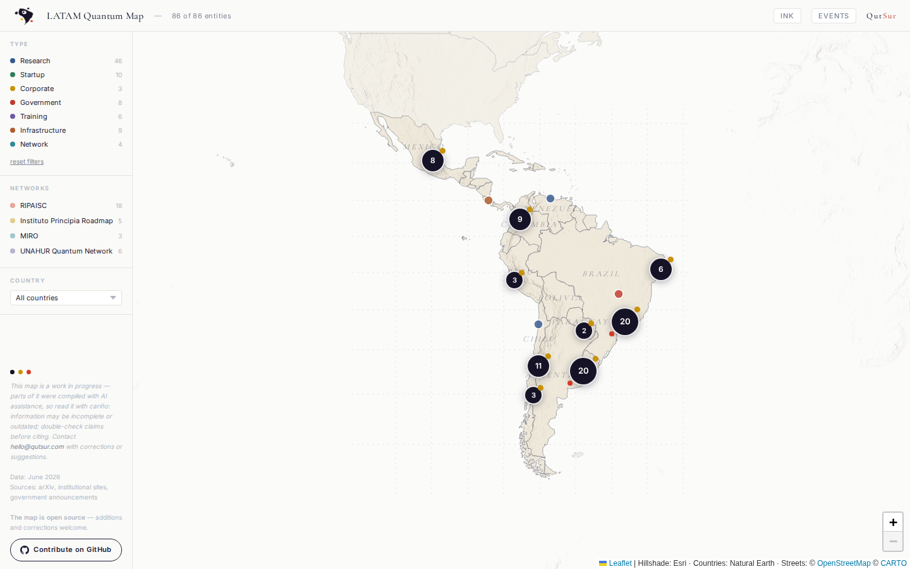

# Mapa Quântico LATAM

🌐 [English](README.md) | [Español](README.es.md) | **Português**

Um mapa aberto e interativo de quem faz tecnologia quântica na América Latina — laboratórios, startups, empresas, programas de governo, formação, infraestrutura e redes.

**→ Veja o mapa ao vivo: [qutsur.com/LATAM-quantum-map](https://qutsur.com/LATAM-quantum-map/)**

[](https://qutsur.com/LATAM-quantum-map/)

**85+ lugares em 12 países.** Mantido por [QutSur](https://qutsur.com). Leia com carinho — é um trabalho em andamento.

---

## ✏️ Adicionar ou corrigir um lugar — 2 minutos, sem programar

Conhece um laboratório, startup ou programa quântico que está faltando ou errado? Conte pra gente. Você não precisa mexer em código.

### ➕ [Clique aqui para **adicionar um lugar**](../../issues/new?template=add-entity.yml)

Preencha o formulário curto: **nome · tipo · cidade · uma ou duas frases sobre o que fazem · um link** (o site deles ou um artigo). Envie.

### 🔧 [Clique aqui para **corrigir ou remover um lugar**](../../issues/new?template=fix-entity.yml)

Diga o que está errado e cole um link. Envie.

**Pronto.** Um bot lê o seu formulário, posiciona no mapa e abre uma proposta automaticamente — normalmente em menos de um minuto. Um mantenedor dá uma olhada rápida e aprova.

> ⚠️ **Um link de fonte é sempre obrigatório.** Sem link, não entra. (O site oficial, um artigo ou um paper.)

---

<details>
<summary>🛠️ Para desenvolvedores</summary>

O mapa é HTML puro + [Leaflet](https://leafletjs.com); todo o conteúdo vive em três arquivos JSON:

| Arquivo | Conteúdo |
|---------|----------|
| `data/entities.json` | os lugares |
| `data/networks.json` | redes regionais |
| `data/events.json` | eventos |

Edite **apenas** `data/*.json`, rode `python3 scripts/validate_data.py` e abra um PR (o CI rejeita qualquer coisa que toque outros arquivos). Esquema e orientação de campos: [`agent_instructions.md`](agent_instructions.md). Fontes: [`sources.md`](sources.md).

```bash
python3 -m http.server 8000   # rodar localmente a partir da raiz do repo
```

Contribuições assistidas por IA são bem-vindas — aponte seu agente para `agent_instructions.md`.

</details>

## Licença

Código: [MIT](LICENSE) · Dados: [CC BY 4.0](https://creativecommons.org/licenses/by/4.0/) — reutilize livremente com atribuição a *QutSur — Mapa Quântico LATAM*.
